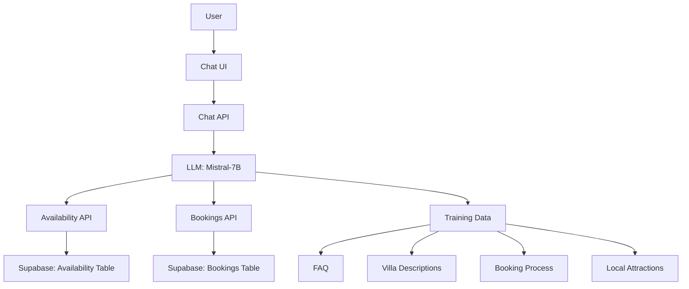

# AI Chat Architecture Plan

## Overview

This document outlines the architecture for integrating an AI-powered chatbot into the booking system for Villa Bruno. The goal is to provide a seamless and intelligent booking experience for users.

## Key Decisions

### 1. Availability Checking

- **Approach**: Create a new API route for availability checking to ensure separation of concerns and flexibility.
- **Endpoint**: `/api/availability`
- **Functionality**: This route will fetch and merge calendar data from Airbnb, Booking, and VRBO, and return availability status for specific date ranges.

### 2. Bookings Database

- **Database**: Supabase
- **Migration**: Migrate the existing Sanity bookings logic to Supabase for better scalability and analytics.
- **Schema**:
  - **Bookings Table**:
    - `id`: UUID (Primary Key)
    - `check_in`: Timestamp
    - `check_out`: Timestamp
    - `guest_name`: Text
    - `source`: Text (e.g., Airbnb, Booking, VRBO, Direct)
    - `uid`: Text (Unique identifier from the source platform)
    - `created_at`: Timestamp (Automatically set by Supabase)
  - **Availability Table**:
    - `id`: UUID (Primary Key)
    - `start_date`: Timestamp
    - `end_date`: Timestamp
    - `is_available`: Boolean
    - `updated_at`: Timestamp (Automatically updated by Supabase)
  - **ChatSessions Table**:
    - `id`: UUID (Primary Key)
    - `user_id`: Text (Reference to the user, if applicable)
    - `session_start`: Timestamp
    - `session_end`: Timestamp
    - `language`: Text (Language used in the session)
  - **ChatMessages Table**:
    - `id`: UUID (Primary Key)
    - `session_id`: UUID (Reference to ChatSessions)
    - `sender`: Text (e.g., user, assistant)
    - `message`: Text
    - `timestamp`: Timestamp

### 3. LLM Selection

- **Model**: Mistral-7B
- **Reasoning**: Mistral-7B is a powerful open-source model that can be self-hosted, providing a good balance between performance and resource usage. It aligns with the user's preference for open-source solutions.

### 4. Training Data

- **Sources**:
  - FAQ Page: Extract questions and answers to train the assistant on common queries.
  - Villa and Finca Descriptions: Use descriptions and features to provide detailed information.
  - Booking Process: Include information about the booking process, policies, and procedures.
  - Local Attractions: Add details about local attractions, tours, and activities.
- **Approach**:
  - Fine-tune the Mistral-7B model using the extracted data.
  - Design prompts that guide the assistant to use the training data effectively.
  - Ensure multi-language support to cater to a diverse user base.

## Architecture Diagram

## Implementation Steps

### 1. Set Up Supabase Database

- Create the necessary tables (Bookings, Availability, ChatSessions, ChatMessages).
- Set up appropriate relationships and indexes.

### 2. Develop Availability API

- Create a new API route at `/api/availability`.
- Implement logic to fetch and merge calendar data from Airbnb, Booking, and VRBO.
- Return availability status for specific date ranges.

### 3. Develop Bookings API

- Create a new API route at `/api/bookings`.
- Migrate the existing Sanity bookings logic to Supabase.
- Implement logic to create, read, update, and delete bookings in Supabase.
- Ensure proper validation and error handling.

### 4. Integrate Mistral-7B

- Set up the Mistral-7B model for self-hosting or use a managed service.
- Configure the model to use the training data effectively.

### 5. Train the Assistant

- Extract data from FAQ, villa descriptions, booking process, and local attractions.
- Fine-tune the Mistral-7B model using this data.
- Design prompts to guide the assistant's responses.

### 6. Develop Chat UI

- Create a chat interface that can be integrated into the homepage, villa pages, and booking dialog.
- Ensure the UI is responsive and user-friendly.

### 7. Integrate Chat API

- Develop the chat API to handle user messages and assistant responses.
- Ensure the API can interact with the LLM, availability API, and bookings API.

### 8. Test and Deploy

- Conduct unit tests for individual components.
- Perform integration tests to ensure all components work together seamlessly.
- Deploy the system in phases, starting with basic chat functionality and gradually adding more features.

## Success Metrics

- **User Engagement**: Measure the number of interactions and sessions with the chatbot.
- **Reduction in Support Inquiries**: Track the decrease in support tickets related to booking and FAQ.
- **Conversion Rate Improvement**: Monitor the increase in booking conversions attributed to the chatbot.
- **User Satisfaction Scores**: Collect feedback from users to gauge their satisfaction with the chatbot.

## Next Steps

1. Review and finalize the architecture plan with the user.
2. Proceed with the implementation of the plan.
