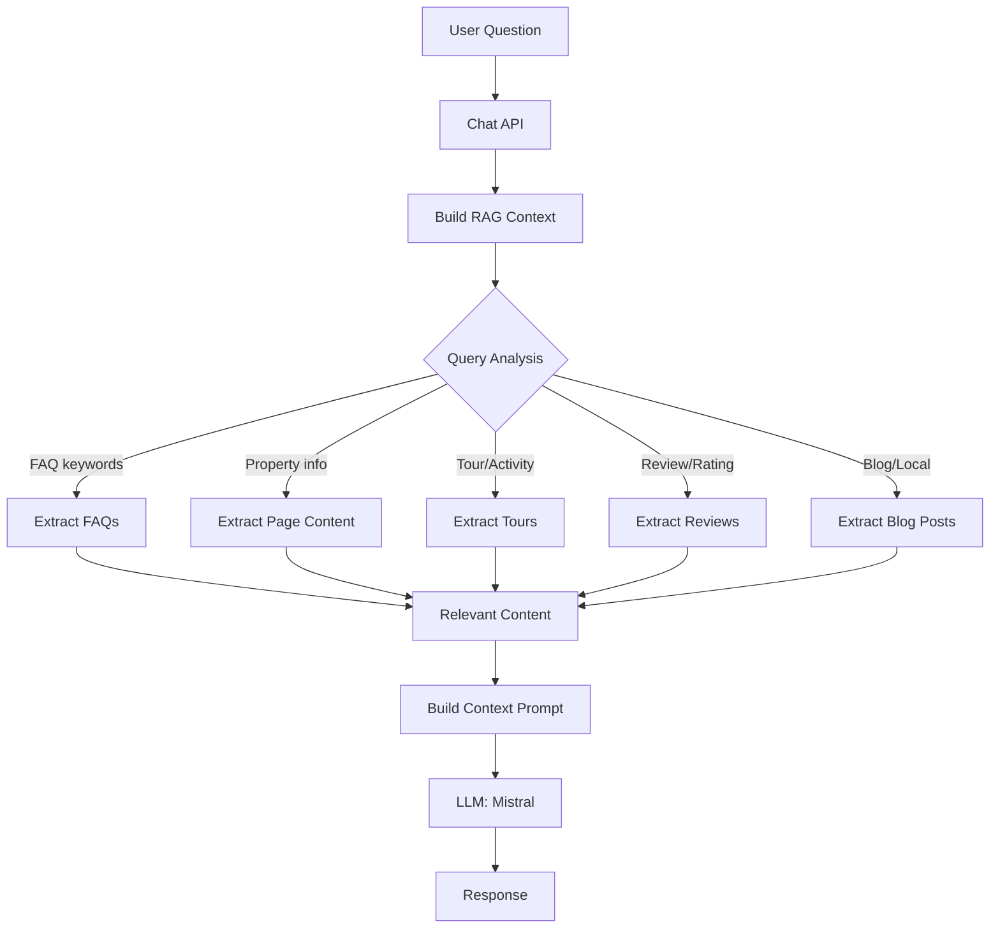

# Sanity RAG Implementation for AI Chatbot

## Overview

This document outlines the implementation of a Retrieval-Augmented Generation (RAG) system that extracts data from Sanity Studio to provide accurate, up-to-date responses in the AI chatbot for Villa Bruno.

## Architecture



## Data Sources

The RAG system extracts data from the following Sanity content types:

### 1. FAQs

- **Schema**: `faq`
- **Fields**: question, answer, keywords, category, language
- **Usage**: Answer common questions about booking, policies, amenities
- **Extraction**: [`extractAllFAQs()`](src/lib/sanity-data-extractor.ts:10), [`searchFAQs()`](src/lib/sanity-data-extractor.ts:218)

### 2. Villa Descriptions & Pricing

- **Schema**: `page`
- **Fields**: title, subtitle, description, body, price, categories
- **Usage**: Provide detailed property information and pricing
- **Extraction**: [`extractPageContent()`](src/lib/sanity-data-extractor.ts:38), [`extractAllPages()`](src/lib/sanity-data-extractor.ts:52)

### 3. Tours & Activities

- **Schema**: `tour`
- **Fields**: title, description, location, duration, price, isFeatured, isNew
- **Usage**: Recommend local attractions and activities
- **Extraction**: [`extractAllTours()`](src/lib/sanity-data-extractor.ts:68), [`searchTours()`](src/lib/sanity-data-extractor.ts:254)

### 4. Reviews

- **Schema**: `review`
- **Fields**: platform, author, rating, date, reviewText
- **Usage**: Provide social proof and guest experiences
- **Extraction**: [`extractAllReviews()`](src/lib/sanity-data-extractor.ts:100), [`extractTopReviews()`](src/lib/sanity-data-extractor.ts:118), [`getAverageRating()`](src/lib/sanity-data-extractor.ts:268)

### 5. Blog Posts

- **Schema**: `post`
- **Fields**: title, body, author, categories, publishedAt
- **Usage**: Share information about local attractions, tips, and experiences
- **Extraction**: [`extractAllPosts()`](src/lib/sanity-data-extractor.ts:140), [`searchPosts()`](src/lib/sanity-data-extractor.ts:236)

## Implementation Files

### 1. Data Extraction Utilities

**File**: [`src/lib/sanity-data-extractor.ts`](src/lib/sanity-data-extractor.ts:1)

Contains all GROQ queries to fetch data from Sanity:

```typescript
// Extract all FAQs
await extractAllFAQs()

// Extract FAQs by category
await extractFAQsByCategory("booking")

// Extract page content
await extractPageContent("villa-bruno")

// Extract all tours
await extractAllTours()

// Extract top reviews
await extractTopReviews(10)

// Extract all blog posts
await extractAllPosts()

// Search across content
await searchFAQs("booking", "en")
await searchPosts("beach", "en")
await searchTours("adventure", "en")

// Get average rating
await getAverageRating()
```

### 2. RAG Context Builder

**File**: [`src/lib/rag-context-builder.ts`](src/lib/rag-context-builder.ts:1)

Intelligently builds context based on user query and page context:

```typescript
// Build context for a user query
const context = await buildRAGContext("What tours are available?", {
  page: "homepage",
  locale: "en",
})

// Search across all content types
const results = await searchAllContent("beach", "en")

// Get comprehensive property overview
const overview = await getPropertyOverview("en")
```

**Context Building Logic**:

1. **FAQs**: Extracted when query matches question, answer, or keywords
2. **Property Info**: Extracted when on a specific villa page
3. **Tours**: Extracted when query mentions "tour", "activity", "attraction", "excursion", "trip"
4. **Reviews**: Extracted when query mentions "review", "rating", "feedback", "guest", "experience"
5. **Blog Posts**: Extracted when query mentions "blog", "article", "post", "local", "area", "nearby", "around"

### 3. Chat API Integration

**File**: [`src/app/api/chat/route.ts`](src/app/api/chat/route.ts:1)

Integrates RAG context into the chat flow:

```typescript
// Get user query
const userQuery = messages[messages.length - 1]?.content

// Build RAG context
const ragContext = await buildRAGContext(userQuery, {
  page: context?.page || "homepage",
  slug: context?.propertySlug,
  locale,
})

// Add to system prompt
systemPrompt = `${systemPrompt}\n\n=== RELEVANT INFORMATION FROM OUR DATABASE ===\n${ragContext}\n\nUse this information to answer user's question accurately.`
```

## Query Triggers

The system automatically retrieves relevant content based on keyword detection:

### FAQ Triggers

- Any query that matches FAQ questions, answers, or keywords
- Example: "What's the cancellation policy?", "Is there WiFi?"

### Property Info Triggers

- When user is on a specific villa page
- Example: "Tell me about this property", "What amenities are included?"

### Tour Triggers

- Keywords: "tour", "activity", "attraction", "excursion", "trip"
- Example: "What tours do you offer?", "Any activities nearby?"

### Review Triggers

- Keywords: "review", "rating", "feedback", "guest", "experience"
- Example: "What do guests say?", "How are the ratings?"

### Blog Triggers

- Keywords: "blog", "article", "post", "local", "area", "nearby", "around"
- Example: "Any blog posts about the area?", "What's nearby?"

## Multi-Language Support

The RAG system respects the user's language preference:

```typescript
// All extraction functions support language filtering
const faqs = await extractAllFAQs() // Returns all languages
const englishFAQs = faqs.filter(faq => faq.language === "en")

// Context builder filters by locale
const context = await buildRAGContext(query, { locale: "es" })
```

## Context Limits

To prevent overwhelming the LLM, content is limited:

- **FAQs**: Top 5 relevant results
- **Tours**: Top 8 results
- **Reviews**: Top 5 reviews
- **Blog Posts**: Top 5 posts
- **Property Details**: First 800 characters of body content
- **Blog Previews**: First 200 characters

## Benefits

### 1. Always Up-to-Date

- Content changes in Sanity are immediately reflected in chatbot responses
- No need to retrain the model

### 2. Multi-Language Support

- Leverages existing i18n setup in Sanity
- Responses match user's language preference

### 3. Cost-Effective

- No expensive fine-tuning required
- Uses existing Mistral API

### 4. Maintainable

- Single source of truth in Sanity CMS
- Easy to add new content types

### 5. Flexible

- Easy to extend with new data sources
- Customizable context building logic

## Usage Examples

### Example 1: FAQ Query

```
User: "What's the cancellation policy?"
→ System extracts relevant FAQs
→ LLM provides accurate answer from FAQ data
```

### Example 2: Tour Inquiry

```
User: "What tours are available?"
→ System extracts all tours in user's language
→ LLM presents tour options with details
```

### Example 3: Review Request

```
User: "What do guests say about the property?"
→ System extracts top reviews and average rating
→ LLM summarizes guest feedback
```

### Example 4: Local Attractions

```
User: "What's there to do in the area?"
→ System extracts blog posts about local attractions
→ LLM recommends activities based on blog content
```

## Testing

To test the RAG implementation:

1. **Test FAQ Extraction**

   ```bash
   # Ask questions that match FAQ keywords
   "What's the check-in time?"
   "Is there a pool?"
   ```

2. **Test Tour Extraction**

   ```bash
   # Ask about tours and activities
   "What tours do you offer?"
   "Any adventure activities nearby?"
   ```

3. **Test Review Extraction**

   ```bash
   # Ask about reviews
   "What do guests say?"
   "How are the ratings?"
   ```

4. **Test Blog Extraction**
   ```bash
   # Ask about local attractions
   "What's there to do in the area?"
   "Any blog posts about local attractions?"
   ```

## Future Enhancements

### 1. Vector Search

- Implement vector embeddings for semantic search
- Better matching of user intent to content

### 2. Caching

- Cache frequently accessed content
- Reduce API calls to Sanity

### 3. Personalization

- Track user preferences
- Provide personalized recommendations

### 4. Analytics

- Track which content is most helpful
- Improve content based on user feedback

### 5. Hybrid Search

- Combine keyword search with vector search
- Improve relevance of retrieved content

## Troubleshooting

### Issue: No context is retrieved

**Solution**: Check that content exists in Sanity and is published. Verify language matches user's locale.

### Issue: Context is too long

**Solution**: Adjust context limits in [`rag-context-builder.ts`](src/lib/rag-context-builder.ts:1). Reduce character limits or result counts.

### Issue: Wrong language content

**Solution**: Ensure content has correct `language` field in Sanity. Verify locale is passed correctly to context builder.

### Issue: Slow response times

**Solution**: Implement caching for frequently accessed content. Consider using Sanity's CDN for faster queries.

## Related Files

- [`src/lib/sanity-data-extractor.ts`](src/lib/sanity-data-extractor.ts:1) - Data extraction utilities
- [`src/lib/rag-context-builder.ts`](src/lib/rag-context-builder.ts:1) - Context building logic
- [`src/app/api/chat/route.ts`](src/app/api/chat/route.ts:1) - Chat API integration
- [`src/lib/better-chatbot/config.ts`](src/lib/better-chatbot/config.ts:1) - Chatbot configuration
- [`src/lib/better-chatbot/context-aware.ts`](src/lib/better-chatbot/context-aware.ts:1) - Context-aware prompts

## Conclusion

This RAG implementation provides a robust, maintainable solution for integrating Sanity CMS data with the AI chatbot. It ensures accurate, up-to-date responses while leveraging existing infrastructure and maintaining multi-language support.
